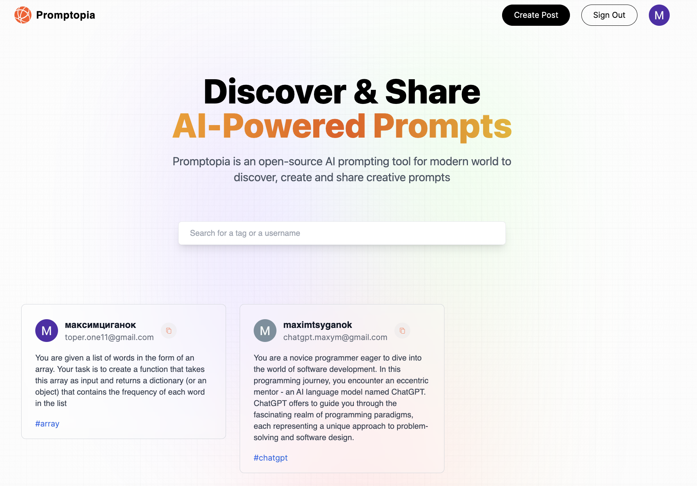
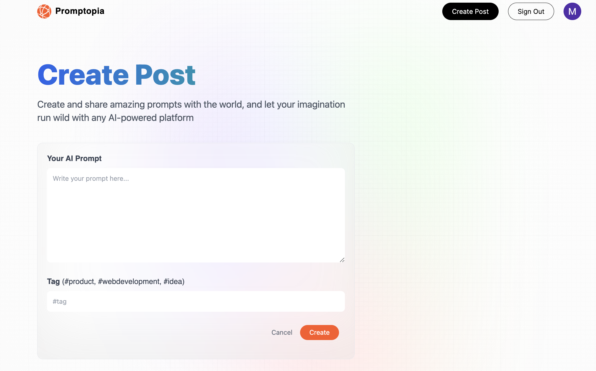

# Promptopia

### [Live Demo](https://promptopia-do5wtd3ts-geofarl.vercel.app/)

Promptopia is an open-source AI prompting tool for modern world to discover, create and share creative prompts.





## Env

Create the `.env` file and configure next variables:

```.env
GOOGLE_ID=your id
GOOGLE_CLIENT_SECRET=your secret

MONGO_URI=your mongo uri

NEXTAUTH_URL=your website url
NEXTAUTH_URL_INTERNAL=your website url
NEXTAUTH_SECRET=your secret

```

## Run

First, run the development server:

```bash
npm run dev
# or
yarn dev
# or
pnpm dev
```

Open [http://localhost:3000](http://localhost:3000) with your browser to see the result.

You can start editing the page by modifying `app/page.js`. The page auto-updates as you edit the file.
